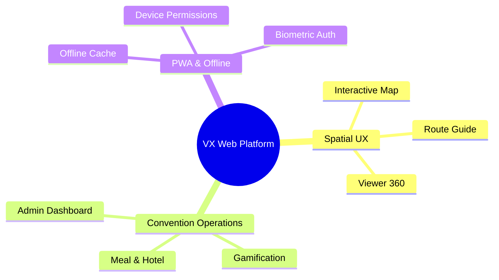
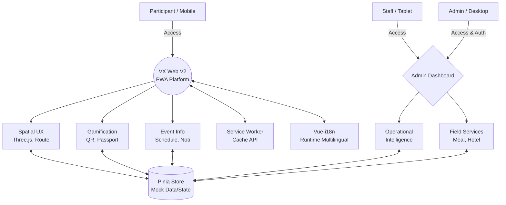

# VX Web V2: Spatial Convention Experience Platform

## 1. 프로젝트 소개 (Introduction)
**VX Web V2**는 대규모 국제대회 및 컨벤션의 물리적 공간과 디지털 정보를 실시간으로 결합하는 **공간 경험 플랫폼(Spatial Experience Platform)**이자 **운영 관제 시스템(Operational Intelligence Dashboard)**입니다.

단순한 홍보용 웹사이트를 넘어, 참가자가 정보를 검색하기 전에 상황과 공간에 맞춰 필요한 정보를 제안하는 **Runtime UX**를 제공합니다. 또한 현장 운영진이 실시간으로 대회를 통제하고 모니터링할 수 있는 강력한 관리자 환경을 통합 제공하는 엔터프라이즈급 플랫폼입니다.

## 2. 왜 만들었는가 (Why VX Exists)
실제 대규모 국제대회(예: KINTEX, COEX 기반 전시, 글로벌 서밋) 현장에서는 다음과 같은 고질적인 문제들이 발생합니다.

*   **길찾기 및 혼잡도 문제**: 수만 명이 몰리는 행사장에서 목적지를 찾지 못해 길을 잃거나 특정 구역에 인파가 집중되어 안전사고 위험이 발생합니다.
*   **열악한 네트워크 환경**: 대규모 인파 밀집으로 인해 Wi-Fi 및 셀룰러 데이터망이 마비되어 앱이나 웹사이트 사용이 불가능해집니다.
*   **실시간 소통 부재**: 긴급 상황 발생 시 전체 참가자에게 즉각적으로 공지를 전파할 수단이 부족합니다.
*   **복잡한 현장 운영**: 도시락 배부, 호텔 체크인, 리워드 지급 등 수많은 현장 운영 업무가 수작업이나 파편화된 시스템으로 진행되어 비효율을 초래합니다.
*   **다국어 지원의 한계**: 수많은 국가에서 온 참가자들에게 일관되고 정확한 언어 지원을 런타임에 제공하기 어렵습니다.

**VX Web V2는 이러한 실제 운영 문제들을 해결하기 위해 탄생했습니다.** 
오프라인 환경에서도 작동하는 PWA 구조, 3D/2D 공간 기반의 내비게이션, 그리고 즉각적인 데이터를 제공하는 운영 관제 시스템을 하나로 통합하여 참가자에게는 매끄러운 경험을, 운영진에게는 완벽한 통제력을 제공합니다.

## 3. 벤 다이어그램: 플랫폼 비전

VX Web V2는 세 가지 핵심 영역의 교집합으로 설계되었습니다.



*(구조적 비전)*
```text
           [ Spatial UX ]
                 │
        ┌────────┴────────┐
        │                 │
[ Convention Ops ]──[ PWA / Offline ]
        │                 │
        └──────┬──────────┘
           VX Web Platform
```

## 4. 참가자 경험 (Participant Experience)
VX Web은 참가자의 여정을 따라 유기적으로 연결된 기능들을 제공합니다.

*   **Home V2 (Live)**: 행사장 진입 시 가장 먼저 마주하는 대시보드. 실시간 이벤트, 혼잡도, 긴급 공지(Ticker)가 즉각적으로 표시됩니다.
*   **Interactive Map & Route Guide**: 단순 지도가 아닌 실내 내비게이션. 혼잡도를 피해 가는 우회 경로 및 엘리베이터 중심의 무장애(Accessibility) 경로를 실시간으로 제안합니다.
*   **Viewer 360**: Three.js 기반의 360도 공간 탐색. 물리적 공간 이동 전 가상 핫스팟을 통해 공간 정보를 입체적으로 미리 확인할 수 있습니다.
*   **Gamification (Passport, Quests, Badges, Reward)**: 특정 공간 방문을 유도하여 인구 밀집을 분산시키는 전략적 도구입니다. QR 스캔을 통해 스탬프를 모으고 보상을 수령하는 과정이 게임처럼 전개됩니다.
*   **Event Schedule**: 실시간 진행 상태(LIVE)가 반영되는 이벤트 타임라인으로, 세션 지연이나 변경 사항을 즉시 확인할 수 있습니다.

## 5. 운영 관제 시스템 (Admin Operations)
단순한 데이터 조회가 아닌, 현장 운영의 병목을 직접 해결하는 Command Center입니다.

*   **Operational Intelligence (운영 관제)**: 전체 행사장의 실시간 혼잡도, 입장객 수, 시스템 상태를 모니터링하고 긴급 공지(Red Alert)를 발송합니다.
*   **Gamification Control (리워드 관리)**: 스탬프 발급 현황과 재고를 관리하며, 특정 구역으로 인파를 유도하기 위한 퀘스트를 동적으로 활성화합니다.
*   **Meal Distribution (도시락 배부)**: 점심시간 등 트래픽이 몰리는 시간대에 QR 스캐너를 통해 배부 내역을 빠르게 처리하고 통계를 확인합니다.
*   **Hotel Management (호텔 관리)**: 외부 숙박 시설 연계 시 참가자의 QR을 스캔하여 체크인/체크아웃 상태를 신속하게 동기화합니다.
*   **Security Telemetry (보안 모니터링)**: 비정상적인 접근, 기기 오류, 권한 거부 사례를 실시간 로그로 수집하여 현장 요원을 즉각 배치할 수 있도록 돕습니다.

## 6. 시스템 아키텍처



## 7. Runtime i18n 시스템
글로벌 행사 환경을 완벽히 지원하기 위해 독자적인 런타임 검증 다국어 시스템을 구축했습니다.

*   **Korean (ko) Source of Truth**: 모든 다국어 키와 구조의 마스터는 한국어 파일(`src/i18n/locales/ko`)입니다.
*   **Runtime-safe i18n**: 하드코딩된 UI 텍스트(Hardcoded strings) 사용을 엄격히 금지하며, 누락된 키가 런타임에 에러를 유발하지 않도록 검증 툴 체인(`scripts/check-i18n-keys.cjs`)을 포함합니다.
*   **Offline-safe Localization**: 언어팩은 PWA 캐시에 우선 저장되어 네트워크 단절 시에도 완전한 다국어 경험을 제공합니다.
*   **지원 언어**: `ko` (Master), `en`, `ja`, `zh-TW`, `es`, `ru`

## 8. PWA / Offline 구조
국제대회 현장의 극심한 네트워크 불안정(Wi-Fi 포화, 셀룰러 마비)을 극복하기 위한 필수 아키텍처입니다.

*   **Offline Map & Asset Cache**: 앱 초기 로딩 시 혹은 설정의 '데이터 관리'를 통해 지도 데이터, 360 파노라마 이미지, 기본 UI 에셋을 Service Worker Cache에 사전 적재(Pre-caching)합니다.
*   **PWA Install**: 네이티브 앱 설치 없이 브라우저에서 '홈 화면에 추가'를 통해 앱처럼 동작하며, 오프라인 상태에서도 구동을 보장합니다.
*   **Device Permissions**: 오프라인 동작을 위해 스토리지, 카메라(현장 스태프의 QR 스캔용), 위치정보 접근 권한을 브라우저 API 레벨에서 안전하게 관리합니다.

## 9. Mock 기반 런타임 아키텍처 (Current Scope)
현재 프로젝트는 프론트엔드 역량과 UX/UI 설계 검증에 집중하기 위해 **Mock Operational Backend** 기반으로 동작합니다.

*   **Mock State**: Pinia 스토어를 통해 실시간 데이터 변경, QR 스캔 검증, 리워드 소진 등을 시뮬레이션합니다.
*   **No Backend Dependency**: 프론트엔드 단독으로 모든 운영 관제 시나리오와 사용자 여정을 체험하고 검증(Harness Engineering)할 수 있습니다.
*   **미래 확장성**: 스토어 내부의 Mock 데이터를 실시간 API 호출(`fetch` / WebSocket) 로직으로 교체하기만 하면 즉시 실제 백엔드와 연동될 수 있도록 Service/Store 계층을 철저히 분리해 두었습니다.

## 10. 실제 운영 시나리오 (Operational Scenario)

**[참가자 여정 (Participant Journey)]**
1.  **행사장 진입 전**: PWA 앱을 홈 화면에 설치하고 오프라인 지도 데이터를 사전 다운로드합니다.
2.  **행사장 탐색**: 셀룰러 망이 지연되는 환경에서도 **Route Guide**를 열어 실내 맵을 확인하고 엘리베이터 접근 경로로 이동합니다.
3.  **이벤트 참여**: 홀 곳곳에 숨겨진 QR 코드를 찾아 스캔하여 **Passport**에 스탬프를 모읍니다.
4.  **리워드 획득**: 퀘스트를 달성하고, 리워드 배부처에서 획득한 코드를 제시하여 기념품을 수령합니다.

**[운영진 여정 (Staff Journey)]**
1.  **상황 인지**: **Admin Dashboard**에서 제2전시장의 혼잡도(Congestion) 게이지가 RED 상태임을 감지합니다.
2.  **트래픽 제어**: 인파 분산을 위해 제1전시장으로 향하는 팝업 퀘스트(경험치 2배)를 즉각 활성화하고, **Notification Hub**를 통해 전체 푸시 알림을 송출합니다.
3.  **현장 서비스 제공**: 트래픽이 몰리는 점심시간, 스태프가 태블릿의 **Meal Scanner** 화면을 열고 기기 카메라를 통해 참가자의 예약 QR을 0.5초 이내에 스캔/지급 처리합니다.

## 11. 향후 로드맵 (Roadmap)
VX Web 플랫폼은 단순 프로토타입을 넘어 다음과 같은 엔터프라이즈 시스템 통합을 목표로 합니다.

*   **WebSocket 실시간 텔레메트리**: 혼잡도, 입장객 데이터, 위치 데이터를 양방향 소켓으로 실시간 전송합니다.
*   **BLE Beacon 실내 측위**: 단순 SVG 매핑을 넘어 비콘 연동 기반의 정밀 실내 위치 추적(IPS)을 지원합니다.
*   **AI 기반 우회 경로 추천**: 트래픽 패턴을 머신러닝으로 분석해 병목 구간을 사전 예측하고, 참가자들에게 동적으로 우회로를 추천합니다.
*   **실시간 Push 서버 통합**: 브라우저 알림 권한과 연동된 백엔드 푸시 서버(FCM/APNs)를 구축합니다.
*   **RBAC 및 실제 DB 연동**: 운영자 직급별(Staff/Manager/Security) 세밀한 권한 제어 모델(Role-Based Access Control)을 도입하고, PostgreSQL/Redis 연동을 완료합니다.

## 12. 프로젝트 구조 (Project Structure)
역할 분리 원칙(Separation of Concerns)에 따라 프론트엔드 아키텍처를 구성했습니다.

```text
VX_Web_Demo/
├── scripts/         # i18n 무결성 검증, 상태 스캔 등 Harness 자동화 툴
├── public/          # PWA Manifest, favicon 등 정적 파일
└── src/
    ├── admin/       # (Admin) 운영 관제, 리워드, 호텔, 보안, 도시락 모듈 
    ├── components/  # (UI) 재사용 가능한 공통 UI 레이아웃, 지도, 설정 패널
    ├── composables/ # (Logic) Vue 3 Composition API 기반의 비즈니스 로직
    ├── data/        # (Mock) 시스템 시뮬레이션을 위한 더미 데이터베이스 세트
    ├── i18n/        # (Lang) 런타임 다국어 설정 및 언어팩(JSON) 리소스
    ├── router/      # (Nav) Vue Router 기반 화면 라우팅 (V2, Admin 등 분리)
    ├── services/    # (API) 추후 외부 서버 연동을 완벽히 분리해둔 서비스 레이어
    ├── settings/    # (Config) 기기 권한, 오프라인 모드, 디스플레이 설정 모듈
    ├── stores/      # (State) Pinia 기반 중앙 집중식 상태 관리 (Mock DB 역할)
    └── views/       # (Page) 사용자 Facing 최상위 페이지 집합
```

## 13. 기술 스택 (Tech Stack)
*   **Core**: Vue 3 (Composition API), Vite
*   **Routing & State**: Vue Router, Pinia
*   **Localization**: Vue-I18n
*   **Spatial & Styling**: Three.js (Spatial Viewer), Tailwind CSS
*   **Platform Features**: Progressive Web App (PWA), Service Worker, MediaDevices API (Camera)

## 14. Screenshots
### Home V2
*(TODO: Add screenshot of the main spatial dashboard highlighting live ticker and status)*

### Admin Dashboard
*(TODO: Add screenshot of Operational Intelligence Dashboard and Live Congestion Heatmaps)*

### Viewer360 & Spatial Map
*(TODO: Add screenshot of immersive 3D space viewer and interactive route guide)*
